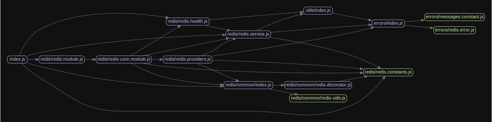

# Welcome to nestjs-redis 👋

[](https://www.npmjs.com/package/@liaoliaots/nestjs-redis)
[](https://www.codefactor.io/repository/github/liaoliaots/nestjs-redis)
[](https://github.com/liaoliaots/nestjs-redis/graphs/commit-activity)
[](https://github.com/liaoliaots/nestjs-redis/blob/main/LICENSE)
[](https://github.com/prettier/prettier)
[](https://conventionalcommits.org)

> Redis(ioredis) module for NestJS framework

| Statements                                                                      | Branches                                                               | Functions                                                                | Lines                                                                 |
| ------------------------------------------------------------------------------- | ---------------------------------------------------------------------- | ------------------------------------------------------------------------ | --------------------------------------------------------------------- |
|  |  |  |  |

## Install

```sh
npm install --save @liaoliaots/nestjs-redis @nestjs/terminus ioredis
```

```sh
npm install --save-dev @types/ioredis
```

## Usage

```sh
TODO
```

## Package dependency overview



## Author

👤 **LiaoLiao <yxiaosong002@gmail.com>**

-   Website: https://github.com/liaoliaots
-   Github: [@liaoliaots](https://github.com/liaoliaots)

## 🤝 Contributing

Contributions, issues and feature requests are welcome!

Feel free to check [issues page](https://github.com/liaoliaots/nestjs-redis/issues).

## Show your support

Give a ⭐️ if this project helped you!

## 📝 License

Copyright © 2021 [LiaoLiao <yxiaosong002@gmail.com>](https://github.com/liaoliaots).

This project is [MIT](https://github.com/liaoliaots/nestjs-redis/blob/main/LICENSE) licensed.

---

_This README was generated with ❤️ by [readme-md-generator](https://github.com/kefranabg/readme-md-generator)_
