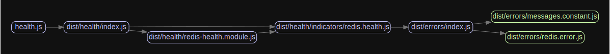

# Welcome to nestjs-redis 👋

[](https://www.npmjs.com/package/@liaoliaots/nestjs-redis)
[](https://www.npmjs.com/package/@liaoliaots/nestjs-redis/v/3.0.0-next.2)

[](https://github.com/liaoliaots/nestjs-redis/blob/main/LICENSE)
[](https://github.com/prettier/prettier)
[](https://www.codefactor.io/repository/github/liaoliaots/nestjs-redis)
[](https://github.com/liaoliaots/nestjs-redis/graphs/commit-activity)
[](https://conventionalcommits.org)

> Redis([ioredis](https://github.com/luin/ioredis)) module for NestJS framework

## Features

-   Supports **redis** and **cluster**
-   Supports health check
-   Supports specify single or multiple clients
-   Supports inject a client directly or get a client via namespace

## Documentation

_For the legacy V2 or V3@next documentation, [click here](./docs/v2/README.md)._

-   [Test coverage](#test-coverage)
-   [Install](#install)
-   [Redis](./docs/v3/redis.md)
    -   [Usage](/docs/v3/redis.md#redis-usage)
    -   [Health check](/docs/v3/redis.md#redis-health-check)
    -   [Options](/docs/v3/redis.md#redis-options)
-   [Cluster](./docs/v3/cluster.md)
    -   [Usage](./docs/v3/cluster.md#cluster-usage)
    -   [Health check](./docs/v3/cluster.md#cluster-health-check)
    -   [Options](./docs/v3/cluster.md#cluster-options)
-   [Examples](./docs/v3/examples.md)
    -   [Redis](./docs/v3/examples.md)
        -   [default](./docs/v3/examples.md#examples-redis)
        -   [sentinel](./docs/v3/examples.md#examples-sentinel)
    -   [Cluster](./docs/v3/cluster.md)
-   [Package dependency overview](#package-dependency-overview)

## Test coverage

| Statements                                                                      | Branches                                                               | Functions                                                                | Lines                                                                |
| ------------------------------------------------------------------------------- | ---------------------------------------------------------------------- | ------------------------------------------------------------------------ | -------------------------------------------------------------------- |
|  |  |  |  |

## Install

### NestJS 8:

```sh
$ npm install --save @liaoliaots/nestjs-redis@next ioredis @nestjs/terminus@next
$ npm install --save-dev @types/ioredis
```

```sh
$ yarn add @liaoliaots/nestjs-redis@next ioredis @nestjs/terminus@next
$ yarn add --dev @types/ioredis
```

### NestJS 7:

```sh
$ npm install --save @liaoliaots/nestjs-redis@2 ioredis @nestjs/terminus@7
$ npm install --save-dev @types/ioredis
```

```sh
$ yarn add @liaoliaots/nestjs-redis@2 ioredis @nestjs/terminus@7
$ yarn add --dev @types/ioredis
```

## Package dependency overview




## Author

👤 **LiaoLiao**

-   Website: https://github.com/liaoliaots
-   Github: [@liaoliaots](https://github.com/liaoliaots)

## 🤝 Contributing

Contributions, issues and feature requests are welcome!

Feel free to check [issues page](https://github.com/liaoliaots/nestjs-redis/issues).

## Show your support

Give a ⭐️ if this project helped you!

## 📝 License

Copyright © 2021 [LiaoLiao](https://github.com/liaoliaots).

This project is [MIT](https://github.com/liaoliaots/nestjs-redis/blob/main/LICENSE) licensed.

---

_This README was generated with ❤️ by [readme-md-generator](https://github.com/kefranabg/readme-md-generator)_
